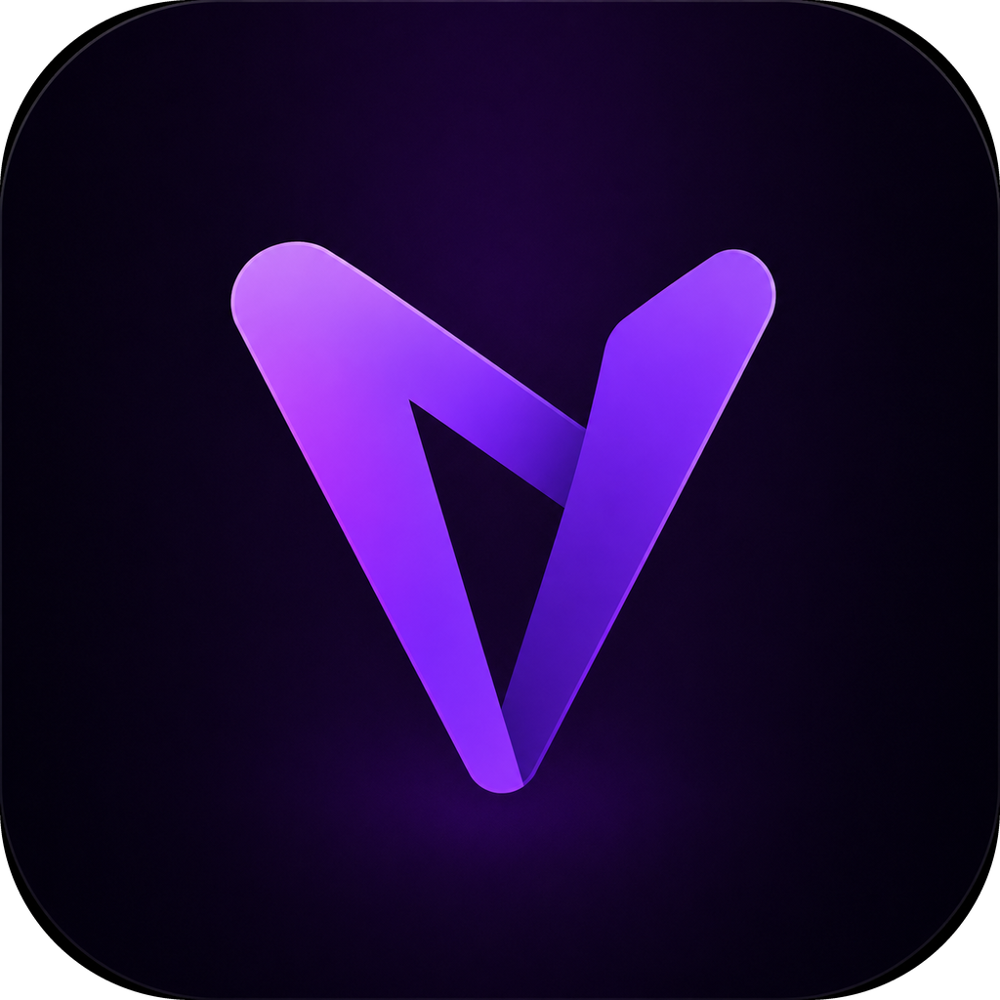

<p align="center">
  
</p>

# VodLink

**Automatic YouTube VODs for your game sessions — open a game, stream to your own channel, and keep the recording forever.**

🎥 **YouTube-powered recording** — VodLink detects when you launch a supported game, creates a YouTube Live broadcast, streams to your own channel, and saves the finished VOD in a local library.

⚡ **Fast embedded playback** — The in-app player uses a lightweight YouTube facade and only loads the real player for the VOD you open.

🎮 **Reliable game recording** — Game capture is built on desktop capture with focus-aware protection, avoiding the classic OBS Game Capture black-screen problem.

🎙️ **Audio control** — Pick whether the stream should include only game audio or also external/system audio and your default microphone.

🖥️ **Ultrawide-aware streaming** — Custom resolutions keep their real canvas while VodLink picks the right YouTube quality ladder and recommended bitrate.

🔐 **Private OBS runtime** — VodLink embeds and initializes its own libobs runtime. It does not read or modify your installed OBS Studio scenes, profiles, plugins, cache, or settings.

☁️ **Optional friend matching** — A tiny Cloudflare Worker can match mutual friends' overlapping sessions when sharing is enabled.

> **Pre-compiled Binaries Available!**
> Download VodLink for Windows, macOS, and Linux from the **[Releases](https://github.com/Dycool/VodLink/releases)** page.
>
> The project website is published from the **[`docs/`](docs/)** folder and can be hosted directly with GitHub Pages.

---

## ✨ Features

| Feature | What it does |
|---|---|
| **Automatic sessions** | Detects supported games and starts/stops YouTube recording around the session. |
| **YouTube VOD library** | Keeps local metadata for your recorded YouTube VODs, clips, thumbnails, games, and timestamps. |
| **Lightweight playback** | Uses a `lite-youtube`-style facade so the app does not spawn heavy iframes for every VOD card. |
| **Private OBS runtime** | Runs with its own bundled OBS/libobs runtime instead of touching your installed OBS Studio setup. |
| **GPU-friendly streaming** | Prefers high-performance GPU paths on Windows and configures OBS/encoder settings for live streaming. |
| **Ultrawide support** | Keeps weird resolutions intact and maps them to the closest higher YouTube tier by pixel count. |
| **Manual overrides** | Recommended bitrate is applied automatically when quality changes, then you can still override it manually. |
| **Optional matching backend** | Uses Cloudflare Workers + D1 only for friend/session matching metadata when sharing is enabled. |

---

## 🧩 Optional Cloudflare Worker

The Worker is only used for mutual friend/session matching. It exposes two session routes:

| Method | Path | Purpose |
|---|---|---|
| `POST` | `/start` | Record that you started streaming a game |
| `GET` | `/stop` | Close the session and return matching mutual friend VODs |

The Worker is designed to be free-tier friendly: one start request, one stop request, short-lived D1 rows, and no video storage.

```bash
cd worker
npm install
npx wrangler d1 create vodlink
npm run db:init:remote
npm run deploy
```

Set your deployed Worker URL in VodLink only if you want friend VOD matching.

---

## 🔨 Building

Requirements: **CMake ≥ 3.25**, a **C++20** compiler, **Qt 6.8+** with Widgets/Network/Auth/WebEngine modules, and a matching private **libobs** development/runtime bundle.

**Configure and build**

```bash
cmake -S . -B build -G Ninja \
  -DCMAKE_BUILD_TYPE=Release \
  -DLIBOBS_ROOT=/path/to/obs-dev-root \
  -DVODLINK_OBS_RUNTIME_DIR=/path/to/private/obs-runtime
cmake --build build --config Release --parallel
```

**Private OBS runtime layout**

| Platform | Runtime location |
|---|---|
| **Windows** | Embedded into `VodLink.exe` when `VODLINK_OBS_RUNTIME_DIR` is set, then extracted at runtime |
| **macOS** | Bundled inside `VodLink.app/Contents/Frameworks/obs-runtime` |
| **Linux** | Bundled inside the AppImage payload at `usr/bin/obs-runtime` |

---


## 🔗 References

| Component | Source |
|---|---|
| **Desktop app** | [Qt 6 Widgets](https://doc.qt.io/qt-6/qtwidgets-index.html), WebEngine, WebChannel |
| **Streaming runtime** | [OBS/libobs](https://obsproject.com/) embedded as a private runtime |
| **Video hosting** | YouTube Live Streaming API, YouTube Data API, RTMP/RTMPS ingest |
| **Playback** | YouTube IFrame API with a lightweight `lite-youtube`-style facade |
| **Matching backend** | Cloudflare Workers + D1 |
| **Local library** | SQLite-backed app data |

---

## 🐛 Reporting Issues

Found a bug or have a feature request? Open an issue at **[github.com/Dycool/VodLink/issues](https://github.com/Dycool/VodLink/issues)** with your OS, game, encoder, resolution/FPS, and relevant debug logs.

---

## 📄 License

See the repository license for details.

