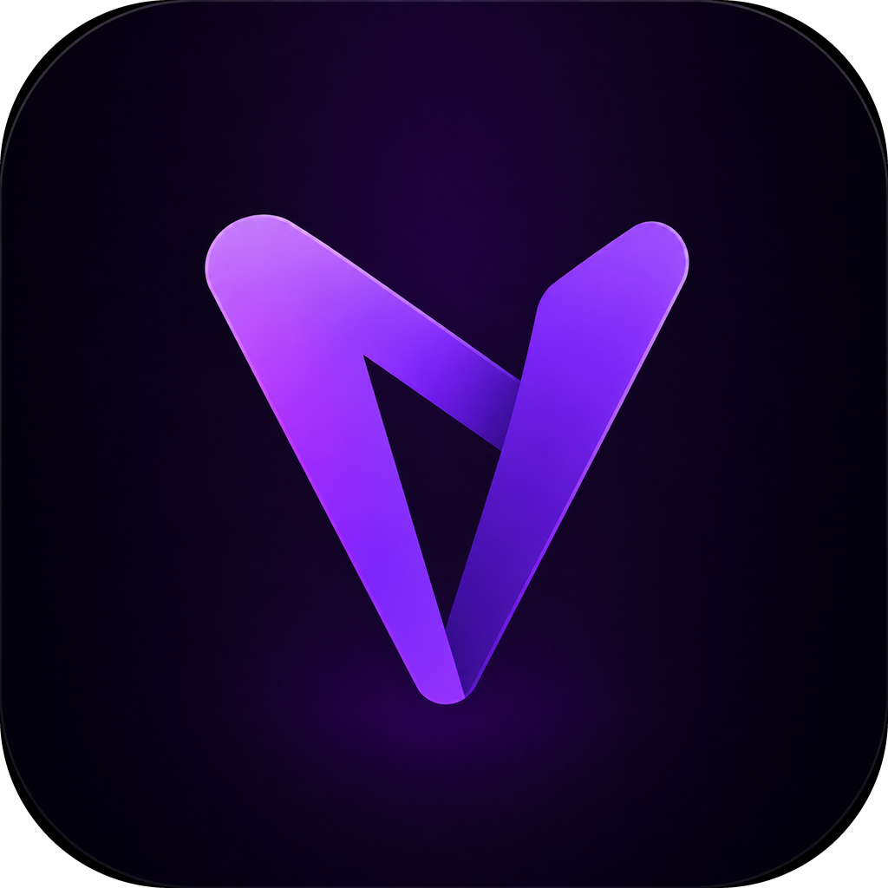

<p align="center">
  
</p>

# VodLink

**Automatic YouTube VODs for your game sessions — implemented in safe Rust.**

VodLink watches for supported games, creates a private YouTube Live broadcast, streams through a private OBS runtime, and keeps the resulting VODs, clips, friend matches, and local metadata together in one library.

## Rust port

The desktop client is Rust end-to-end. The old Qt/C++ application, player bridge, game detector, libobs integration and bootstrap executable are no longer part of the build.

The client serves its UI on loopback and opens it in the default browser. This replaces the Qt/WebEngine/WebView2 layer without adding first-party native FFI. YouTube playback still uses the YouTube IFrame API, including absolute-time switching between overlapping session VODs.

### Safety invariants

First-party Rust is deliberately unable to fall back to unsafe code:

- `#![forbid(unsafe_code)]` is present at crate roots.
- `Cargo.toml` forbids `unsafe_code`, `unused_unsafe`, `unsafe_op_in_unsafe_fn`, `transmute_ptr_to_ptr`, and undocumented unsafe blocks.
- `.cargo/config.toml` passes `-Funsafe-code` to rustc.
- `scripts/check-rust-safety.py` rejects first-party `unsafe`, raw-pointer/FFI escape hatches, `build.rs`, and lint-override attributes.
- CI runs `cargo clippy --all-targets -- -D warnings` and Miri against the Rust-owned core.
- OBS access goes through the pinned safe public API of `libobs-rs`; VodLink itself contains no native pointer code.

See [SAFETY.md](SAFETY.md) for the exact policy.

## Features

| Feature | What it does |
|---|---|
| Automatic sessions | Detects supported games and starts/stops YouTube recording around the session. |
| YouTube VOD library | Stores local metadata for recorded VODs, clips, games, owners and timestamps. |
| Synchronized playback | Switches between overlapping session VODs while preserving absolute session time. |
| Private OBS runtime | Runs a staged libobs runtime without reading or modifying an installed OBS Studio profile. |
| Hardware encoder selection | Uses OBS capability discovery and prefers hardware H.264/HEVC/AV1 encoders. |
| Game/system audio modes | Supports game-only or system audio, plus optional microphone capture. |
| Optional friend matching | Uses the Cloudflare Worker only when VOD sharing is enabled. |
| Existing data compatibility | Reuses and migrates the existing VodLink SQLite database/settings layout. |

## Building the Rust client

The repository pins Rust `1.98.1` and `libobs-rs` revision `0f306186d2f1414fb51e717fafd43f48cfce3114`.

Install the matching OBS runtime helper once:

```bash
cargo install cargo-obs-build --git https://github.com/libobs-rs/libobs-rs --rev 0f306186d2f1414fb51e717fafd43f48cfce3114 --locked
```

Stage the private OBS runtime beside the executable and build:

```bash
cargo obs-build build --out-dir target/release
cargo build --release
```

For first-party core development without native OBS dependencies:

```bash
cargo clippy --no-default-features --all-targets -- -D warnings
cargo test --no-default-features --all-targets
```

Run the deterministic source-policy check with:

```bash
python3 scripts/check-rust-safety.py
```

### Windows installer

With Inno Setup 6 installed:

```powershell
./scripts/package-windows.ps1 -Version 0.2.0
```

The script packages `target/release/vodlink.exe` and the runtime staged by `cargo-obs-build` into `installer-output/VodLink-Windows-x64-Setup.exe`. There is no C++ bootstrapper.

## Optional Cloudflare Worker

The Worker is separate from the desktop client and is only used for mutual friend/session matching. It stores no video.

```bash
cd worker
npm install
npx wrangler d1 create vodlink
npm run db:init:remote
npm run deploy
```

Set the deployed Worker URL through `VODLINK_WORKER_URL` when building/running VodLink if friend matching is wanted.

## Configuration

VodLink reads the Google OAuth client configuration and optional Worker endpoint from environment variables:

- `VODLINK_GOOGLE_CLIENT_ID`
- `VODLINK_GOOGLE_CLIENT_SECRET` (optional for installed-app clients)
- `VODLINK_WORKER_URL` (optional)

The local database and settings remain under VodLink's platform-specific application-data directory.

## References

| Component | Implementation |
|---|---|
| Desktop client | Rust + Tokio + Axum |
| Streaming runtime | pinned `libobs-rs` safe wrappers around OBS/libobs |
| HTTP/OAuth/YouTube | Reqwest + Rust OAuth/PKCE implementation |
| Local library | Rusqlite / SQLite |
| Playback UI | loopback web UI + YouTube IFrame API |
| Matching backend | Cloudflare Workers + D1 |

## License

GPL-3.0-only. See [LICENSE](LICENSE).
